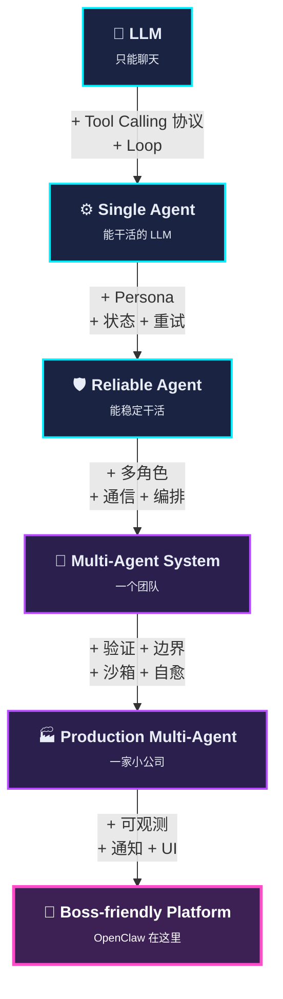

# Module 00 — 总览 & 学习路径

## 三句话讲清楚我们要学什么

1. **LLM 本身只能聊天**。它不能读文件、不能调 API、不能执行代码——它只会输出 token。
2. 给 LLM 接上一组**工具（tools）**和一个**循环（loop）**，让它"思考-调用工具-看结果-再思考"，这就是 **Agent**。
3. 当一个 Agent 干不完一件复杂事情，就让多个 Agent 互相协作——这就是 **Multi-Agent System**。本教程的 OpenClaw 公司就是这种系统的真实实现。

## 心智地图

每个箭头都对应教程的一个模块。请把这张图记住——面试的时候，对方问你任何一个细节问题，你都能定位到这张图的哪一层。

## 你将带走什么

学完之后，你的简历上可以加一段：

> Built a self-healing multi-agent AI software studio (8 specialized agents, all running on local Ollama models). Designed structural verification gates (exit-code capture, HTTP smoke-tests, file-on-disk verification) that catch hallucinated tool calls — a common failure mode of 7B-13B models. Implemented a watchdog process that guarantees ground-truth `STATUS.json` even when the orchestrator agent forgets to stamp.

每一个名词都能展开讲 5 分钟。

## 我们会反复用到的关键词

提前记下来，看到不要慌：

| 概念 | 一句话定义 | 在哪个模块详讲 |
|---|---|---|
| **Token** | LLM 看到的最小单位（不是字符也不是单词，是 BPE 切出来的子词） | 02 |
| **Context Window** | LLM 一次能看的最大 token 数；超了就要丢东西或截断 | 02 |
| **Sampling** | LLM 从概率分布里挑下一个 token 的方法（temperature / top-p） | 02 |
| **Quantization** | 把模型的浮点权重压成低位整数（Q4_K_M = 4 bit），换内存换不了多少精度 | 02 |
| **Tool / Function Calling** | LLM 通过结构化 JSON 调用外部函数的协议 | 03 |
| **ReAct** | "Reasoning + Acting" 循环：思考 → 调工具 → 观察 → 再思考 | 03/04 |
| **System Prompt / Persona** | 写在最前面、永远不变的"角色说明书" | 04 |
| **Hallucinated Tool Call** | 模型在文本里假装调用了工具，但实际没有发起 tool call | 06 |
| **Trust-but-verify** | 工人说"我写好了"，PM 必须 read 一下才信 | 06 |
| **Structural Gate** | 不靠 LLM 自评，靠 exit code / HTTP code 这种二进制信号判定通过 | 06 |
| **Lane Discipline** | 每个 Agent 只能动自己白名单内的文件 | 07 |
| **Sandboxing** | 限制 Agent 能执行的命令 / 能访问的文件 | 08 |
| **Watchdog** | 兜底进程：Agent 没干完的事，由它来补 | 06/09 |
| **STATUS.json** | 项目唯一的"完成签名"，仪表盘只信它 | 10 |

## 实操准备

如果你想跟着跑代码，需要：

1. macOS 或 Linux（教程默认 macOS）
2. Python 3.10+
3. [Ollama](https://ollama.com) 装好，并 `ollama pull gpt-oss:20b qwen2.5-coder:7b`（约 20GB 磁盘）
4. [OpenClaw](https://github.com/openclaw/openclaw) CLI（按 [README](../../README.md) 装）
5. 至少 32GB RAM（我们要同时跑 2 个本地模型 + Flask 仪表盘 + 浏览器）

不想跑代码也没关系——所有代码都贴在文中，你能看懂就行。

## 学习方法建议

- **先读 → 再实现 → 最后讲给别人听**。能讲清楚才是真懂了。
- **每个模块的「自测题」一定要做**。答不出来就回去重读，别糊弄自己。
- **不要跳模块**。看起来基础的 02 / 03 是后面所有内容的地基，跳了后面 6 7 8 9 全是云里雾里。
- **遇到术语不懂，回这个表查**，别自己猜。

---

## 自测题（看完本模块）

1. 用一句话解释「Agent 和 Chatbot 的区别」。
2. 一个 Multi-Agent 系统什么情况下其实应该退化成 Single Agent？
3. 「Hallucinated Tool Call」具体指什么？为什么本地小模型容易犯？
4. 「Structural Gate」相比「让 LLM 自己说 OK 不 OK」好在哪？

参考答案在每个对应模块里——别在这里偷看。

下一站：[Module 01 — 为什么 2026 年大家都在做 Agent](01-why-agents.md)
