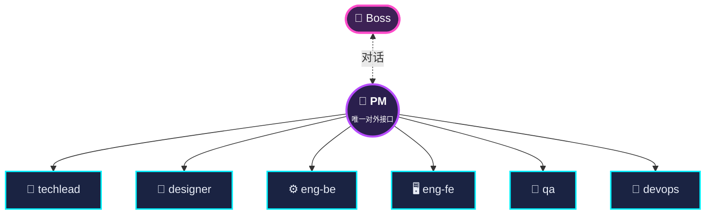
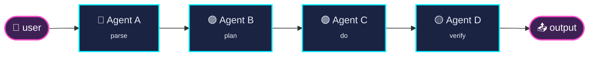
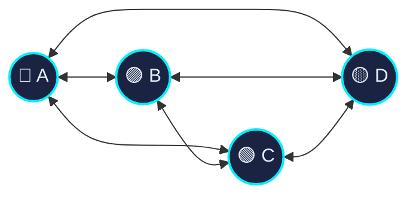
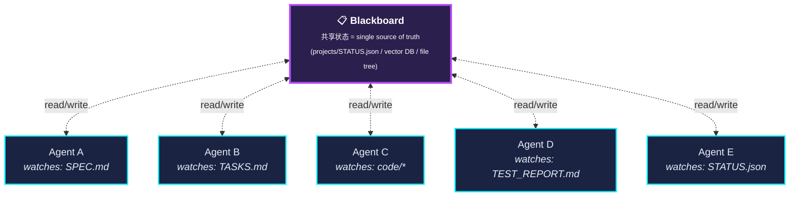

# Module 05 — 多 Agent 编排模式

> 这一章是教程的"主菜"。读完你应该能在白板上画 4 种以上多 Agent 通信模式，能解释为什么我们的项目选择了"Hub-and-Spoke"，能讲明白多 Agent 系统的成本和延迟代价。

---

## 1. 灵魂拷问：什么时候不该用多 Agent

**80% 的"我想做多 Agent"其实应该是"我想做单 Agent + 好工具"**。

### 1.1 单 Agent 解决的迹象

- 任务能在一个 system prompt 里说清楚
- 不需要不同的"角色立场"
- 输入输出长度都在一个 context 内
- 各步骤强依赖，没法并行

→ 用一个大 context 的强模型 + 几个工具搞定。

### 1.2 应该上多 Agent 的迹象

- **角色冲突**：写代码的人和审代码的人立场对立（QA 必须挑刺，eng 必须辩护）
- **专业化**：不同角色用不同模型最合适（Coder 模型 vs 通用模型）
- **并行**：3 个工程师同时写不同模块
- **隔离**：一个 Agent 的失败不能污染其他人的 context
- **可解释**：老板想看"PM 决策路径"，必须有显式的角色边界

### 1.3 经验法则

> "如果你能用 GPT-4 + 一个 100K context 一次跑完，就先这么做。多 Agent 会在质量、成本、延迟、复杂度上全面付出代价——你需要明确的**收益**才值得。"

---

## 2. 多 Agent 通信模式

### 2.1 模式 A：Hub-and-Spoke（中心辐射）



**特点**：
- 一个 Agent 是"中心"，所有通信都经过它
- worker 之间不直接说话
- 编排逻辑集中在中心

**优点**：
- 容易调试（所有决策在一个地方）
- 容易加新角色
- 老板只用跟一个 Agent 说话

**缺点**：
- 中心是瓶颈（吞吐有限）
- 中心挂了全挂

**适合**：流程明确的项目（我们的 OpenClaw 公司就是这个）

### 2.2 模式 B：Pipeline（流水线）



**特点**：
- 每个 Agent 是流水线的一站
- 每站接收上一站的输出，产出本站输出

**优点**：
- 极简单
- 容易并行多个任务（一条流水线跑多个 input）

**缺点**：
- 没有反馈环（如果 D 发现 A 错了，要重头）
- 不灵活（流程固定）

**适合**：批处理、ETL 类任务

### 2.3 模式 C：Peer-to-Peer / Swarm（蜂群）



**特点**：
- 任意 Agent 可以联系任意其他 Agent
- 没有中心
- 通常用 broadcast / topic 通信

**优点**：
- 容错强（任何一个挂不影响整体）
- 容易扩展并发

**缺点**：
- 调试地狱（没人知道全貌）
- 容易死锁 / livelock
- 协议设计极难

**适合**：研究系统、大规模并发探索（如 multi-agent search）

我们的项目里 OpenClaw 通过 `tools.sessions.visibility = all` + agentToAgent 允许这种通信，但**实际只 PM 调用 worker**——理论支持 P2P，工程上选择 Hub-and-Spoke。

### 2.4 模式 D：Marketplace / Auction（市场）

```mermaid
flowchart LR
    T(["📋 任务"]) --> AB["🪧 <b>拍卖板</b><br/><span style='font-size:11px;color:#94a3c4'>broadcast</span>"]
    AB -.bid $0.04.-> A["Agent A"]
    AB -.bid $0.02.-> B["Agent B ⭐"]
    AB -.bid $0.07.-> C["Agent C"]
    AB -.bid $0.05.-> D["Agent D"]
    B ==win==> Done(["✅ 执行任务"])
    classDef task fill:#3d2155,stroke:#ff4dca,stroke-width:2px,color:#fff
    classDef board fill:#2a1f4d,stroke:#b84dff,stroke-width:2px,color:#fff
    classDef agent fill:#1a2342,stroke:#00f0ff,stroke-width:2px,color:#e8edf7
    classDef winner fill:#1c3a2a,stroke:#4dffaa,stroke-width:3px,color:#fff
    class T task
    class AB board
    class A,C,D agent
    class B,Done winner
```

**特点**：
- 任务作为"工单"挂出来
- Agent 自己挑活
- 有"价格"机制（cost / specialty）

**优点**：
- 自动负载均衡
- 自动选最合适的 Agent

**缺点**：
- 需要复杂的 utility function 设计
- 容易出现"all rush" 抢热门任务

**适合**：异构 Agent 池、任务类型多样

### 2.5 模式 E：Blackboard（黑板）



**特点**：
- 共享数据结构是 source of truth
- Agent 是"事件驱动"——发现黑板上有适合自己做的，就跳上来做
- 通信通过黑板状态变更

**优点**：
- 解耦极致（Agent 互不知道彼此存在）
- 容易加新 Agent（不用改其他 Agent）

**缺点**：
- 全局状态难管理
- 容易冲突（多个 Agent 抢同一任务）

**适合**：有复杂共享状态的系统（如多 Agent IDE）

我们项目里的"projects 目录 + STATUS.json"就是一个**轻量黑板**——dashboard 通过它判断状态。

### 2.6 选型对比

| 模式 | 复杂度 | 可调试性 | 容错 | 适合规模 |
|---|---|---|---|---|
| Hub-and-Spoke | 低 | 高 | 中 | 小（< 20 Agent） |
| Pipeline | 极低 | 极高 | 低 | 任意 |
| P2P / Swarm | 高 | 低 | 高 | 大 |
| Marketplace | 高 | 中 | 高 | 中-大 |
| Blackboard | 中 | 中 | 中 | 中 |

**面试金句**：

> "我设计的时候默认 Hub-and-Spoke，因为它对运维和老板都最友好。如果遇到必须并发的场景，我会在内部加 Blackboard 让 worker 通过共享状态协作，但对外仍然 Hub。"

---

## 3. 通信介质

四种常见介质：

### 3.1 Shared Filesystem

最简单：Agent A 写 `~/project/SPEC.md`，Agent B 读它。

我们的项目用的就是这个。`projects/<slug>/` 是共享文件系统，所有 artifact 都通过文件传递。

**优点**：调试爽（直接 cat），生命周期清晰（文件存在就是状态存在）
**缺点**：并发写需要锁；状态多了找不着

### 3.2 Message Queue / Session

OpenClaw 的 `sessions_send` 就是这个。每个 Agent 有一个"邮箱"（session），其他 Agent 往这个邮箱发消息。

**优点**：异步，发完立刻返回；容易做超时和重试
**缺点**：消息序列重要，丢一条就乱套

### 3.3 RPC / API

Agent A 直接 HTTP 请求 Agent B。

**优点**：同步、直观
**缺点**：耦合紧（A 必须知道 B 的接口）

### 3.4 Database / KV Store

把所有共享状态写进 PostgreSQL / Redis。

**优点**：高并发、ACID、可监控
**缺点**：每次读写都有 IO 成本；schema 演化痛苦

### 3.5 我们项目的混合方案

```mermaid
flowchart LR
    Boss(["👤 Boss"])
    DASH["📊 Dashboard"]
    PM(("🎯 PM"))
    W1["⚙️ eng-be"]
    W2["🖥️ eng-fe"]
    W3["🧪 qa"]
    FS[("📁 Shared FS<br/>~/.openclaw/...")]

    Boss -->|💬 HTTP / CLI| PM
    Boss -->|🌐 浏览器| DASH
    PM -.->|📨 sessions_send<br/>(message queue)| W1
    PM -.->|📨 sessions_send| W2
    PM -.->|📨 sessions_send| W3
    W1 -->|✍️ write artifact| FS
    W2 -->|✍️ write artifact| FS
    W3 -->|✍️ write artifact| FS
    PM -->|👀 read 验证| FS
    DASH -->|🔍 scan| FS
    DASH -->|🔧 spawn FIX| PM

    classDef boss fill:#3d2155,stroke:#ff4dca,stroke-width:3px,color:#fff
    classDef hub fill:#2a1f4d,stroke:#b84dff,stroke-width:2px,color:#fff
    classDef wkr fill:#1a2342,stroke:#00f0ff,stroke-width:2px,color:#e8edf7
    classDef fs fill:#1c3a2a,stroke:#4dffaa,stroke-width:2px,color:#fff
    class Boss boss
    class PM,DASH hub
    class W1,W2,W3 wkr
    class FS fs
```

混合是常态。**没有一种通信方式能解决所有问题**。

---

## 4. OpenClaw 多 Agent 实现细节

### 4.1 启用 agent-to-agent

默认 OpenClaw 配置 `tools.sessions.visibility: "tree"`，意思是只能看到自己派生的子 session。这阻止了 PM 跟兄弟 Agent 说话。

我们改成：

```bash
openclaw config set tools.sessions.visibility '"all"' --strict-json
openclaw config set tools.agentToAgent.enabled true
openclaw config set tools.agentToAgent.allowlist \
  '["pm","techlead","designer","eng-be","eng-fe","qa","devops","writer"]' \
  --strict-json
```

### 4.2 Session Key 约定

OpenClaw 每个 Agent 有一个长期的 "main" session：

```
sessionKey: "agent:<id>:main"
```

PM 调用 techlead 的时候：

```
sessions_send({
  sessionKey: "agent:techlead:main",
  message: "为 Pomodoro 项目写 TASKS.md，要求...",
  timeoutSeconds: 600
})
```

`timeoutSeconds: 600` 给本地小模型留 10 分钟（cold-start + 推理）。

### 4.3 共享 Workspace

所有 Agent 都能读写 `~/.openclaw/company/projects/<slug>/`。这是事实上的"项目工作区"。

**坑**：默认 OpenClaw 给每个 Agent 隔离 workspace。我们必须把 PROJECTS 目录显式加到每个 Agent 的可访问列表（或者所有 Agent 共用 home）。

---

## 5. 协调难题：3 个 Agent 同时改一个文件

### 5.1 场景

PM 让 eng-be 写 `app.py`，让 eng-fe 写 `templates/index.html`，让 designer 改 `DESIGN.md`。**理论上可并发**。

但如果 eng-be 写 `app.py` 时**也改了** `templates/index.html`（越界），eng-fe 同时也在写它——后写的覆盖先写的。

### 5.2 解决方案

#### 方案 A：串行化

PM 一次只派一个 worker，等它回报再派下一个。
**牺牲并发，换简单**。我们项目目前是这样。

#### 方案 B：文件级锁

worker 写之前 acquire lock，写完 release。
**实现复杂**：怎么处理 deadlock？怎么处理 worker 挂了没 release？

#### 方案 C：CRDT / Conflict-free 数据结构

用 Yjs / Automerge 这种支持并发编辑的格式。
**适合协作编辑**，不适合代码文件。

#### 方案 D：Lane Discipline（边界划清）

eng-be 永远不碰 `templates/`，eng-fe 永远不碰 `*.py`。
**结构性预防**，不需要锁。

我们用的就是 D，详见 Module 07。

---

## 6. 多 Agent 的成本核算

### 6.1 延迟膨胀

单 Agent 一个任务：5 轮 ReAct，每轮 3 秒 → **15 秒**。

多 Agent 同样任务（PM 协调 4 个 worker，每个 worker 5 轮）：
- PM: 4 轮派单 + 4 轮验证 = 8 轮 × 3秒 = 24 秒
- worker × 4: 每个 5 × 3 = 15 秒，串行 = 60 秒
- **总计 ≈ 90 秒，6 倍**

并发能省 worker 部分，但 PM 的串行不能省。

### 6.2 Token 成本膨胀

每个 Agent 都有自己的 system prompt（3-5K tokens），每次调用都发一遍。

8 Agent × 5 次调用 × 4K tokens = **160K tokens / 任务**

单 Agent 同样任务：5 次调用 × 4K = **20K tokens**

**多 Agent 的 token 成本是 8 倍**。

### 6.3 Latency 累积

模型切换（Ollama swap）每次 5-15 秒。8 Agent 跑一遍可能切 5-10 次模型 = **多花 30-150 秒**。

### 6.4 失败放大

一个 Agent 95% 成功率 → 整体 95%。
8 Agent 串联 95% × 95% × ... × 95% = **66%**。

要把整体拉回 95%，每个 Agent 必须 99.4% 成功——很难。

### 6.5 解决：gates、retry、watchdog

我们项目里的 QA gate / DevOps gate / watchdog 就是为了**把整体成功率拉回来**。每个 worker 失败了 PM 重派，最后兜底 watchdog 写 STATUS.json——保证整体可观测，即使中间环节失败。

---

## 7. 编排逻辑放在哪

三个选项：

### 7.1 全在 LLM 里

PM 的 persona 写"phase 1 → phase 2 → phase 3 ..."，LLM 自己执行。
**优点**：灵活，新需求改 prompt 即可
**缺点**：LLM 经常跳步骤、忘 phase；复杂分支难表达

### 7.2 全在代码里

Python 代码写 `state machine`，每一步显式调用对应 Agent。
**优点**：可控、可测、可调试
**缺点**：失去 LLM 灵活性；改流程要改代码

### 7.3 混合（我们项目）

- LLM 负责高层流程（phase 1-10）和决策（哪个 worker 处理哪个 task）
- 代码负责硬约束（API endpoint /run / /fix / /smoke-test）
- 关键节点用结构化检查（QA exit code / DevOps HTTP code）

这是 production 多 Agent 系统的常见架构。

---

## 8. 主流框架对比

| 框架 | 语言 | 通信模式 | 状态管理 | 特点 |
|---|---|---|---|---|
| **LangGraph** | Python | 显式图（节点 + 边） | Checkpoint | 强可视化，调试友好 |
| **CrewAI** | Python | 角色扮演 + Process | 隐式 | 适合任务委派；prompt 很多 |
| **AutoGen** | Python | 多人会议 | 对话历史 | Microsoft，研究色彩重 |
| **OpenAI Swarm** | Python | "Handoff" + 共享上下文 | Memoryless | 简单优雅，缺企业特性 |
| **OpenClaw** | TypeScript | sessions_send + a2a | Filesystem + sessions | 我们项目用的；CLI/IDE 友好 |
| **手撸** | 任意 | 自定义 | 自定义 | 完全可控，但要自己处理重试/日志 |

**面试可能问到**：

> "你为什么不用 LangGraph？"

参考答：

> "选型时考虑过。LangGraph 的图模型适合复杂分支，但对小项目来说 over-engineered。我用 OpenClaw 因为它的 CLI 和 sessions 机制刚好够用，加上我能在它的 hooks 里加自己的 watchdog 逻辑。任何框架到了 production 都得在外面包一层（监控、重试、UI），OpenClaw 已经处理了 IDE 集成这部分，我可以省时间专注 agent 编排逻辑。"

---

## 9. 案例：我们公司的"完整一轮跑流程"

```
[T+0:00]  Boss → PM: "Build a tiny Pomodoro CLI"
[T+0:01]  PM 收到，调 LLM 决定 phase
[T+0:05]  PM 写 SPEC.md (write tool)
[T+0:10]  PM → TechLead: 派单 (sessions_send)
[T+0:15]  TechLead Ollama load (gpt-oss:20b)
[T+0:30]  TechLead 写 TASKS.md (write tool)
[T+0:35]  TechLead 回复 PM "TASKS.md ready"
[T+0:36]  PM trust-but-verify: read TASKS.md → 确认存在
[T+0:40]  PM → eng-be: T1 派单
[T+0:45]  eng-be Ollama load (qwen2.5-coder:7b) — 模型 swap, 10 秒
[T+1:30]  eng-be 写 app.py
[T+1:35]  eng-be 回 PM
[T+1:36]  PM verify
[T+1:40]  PM → eng-fe: T2 派单
[T+1:42]  eng-fe 已 hot (同模型)
[T+2:30]  eng-fe 写 templates/index.html
[T+2:35]  PM verify
[T+2:40]  PM → QA
[T+2:45]  QA Ollama swap → gpt-oss:20b
[T+3:30]  QA 写 TEST_PLAN.md, 跑测试，写 TEST_REPORT.md
[T+3:35]  QA 回 "<RESULT>PASS</RESULT>"
[T+3:40]  PM → DevOps
[T+4:00]  DevOps curl smoke-test endpoint
[T+4:30]  smoke-test 返回 EVIDENCE block
[T+4:35]  DevOps 回 "<RESULT>PASS</RESULT>"
[T+4:40]  PM → Writer
[T+5:00]  Writer 写 README.md
[T+5:05]  PM verify
[T+5:10]  PM 写 STATUS.json
[T+5:15]  Dashboard 检测到 STATUS.json：
            - 前端弹 "DELIVERED" 横幅
            - 浏览器通知
            - 播放 chime 音效
[T+5:15]  PM → Boss: "Pomodoro CLI ready at ~/.openclaw/.../pomodoro/"
```

5 分 15 秒。**实际跑可能更长**——模型 swap、一两次重试都正常。

但你可以从这个时间线里看到：
- 模型 swap 占了不少时间
- worker 串行运行（理论可并发，我们没做）
- 验证环节加在每个交接点
- 最终 STATUS.json 才触发完成通知

---

## 10. 自测题

1. 多 Agent 比单 Agent 强在哪？弱在哪？给至少 3 个维度。
2. 画出 Hub-and-Spoke / Pipeline / P2P / Marketplace / Blackboard 五种模式。
3. OpenClaw 的 `sessions_send` 属于哪类通信介质？
4. 为什么我们项目串行而不并发派 worker？怎么改成并发？需要解决哪些新问题？
5. LangGraph 和我们项目的实现，主要差异在哪？

下一站：[Module 06 — Trust & Verify](06-trust-verify.md)
