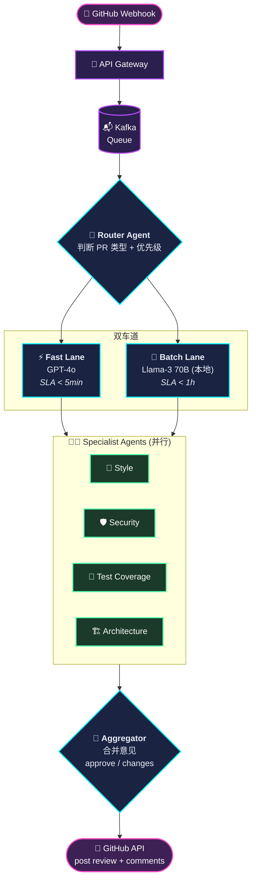
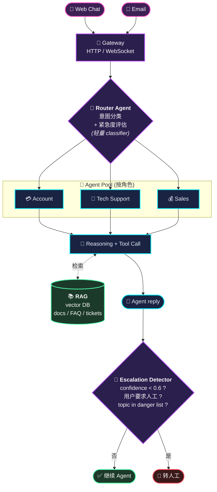
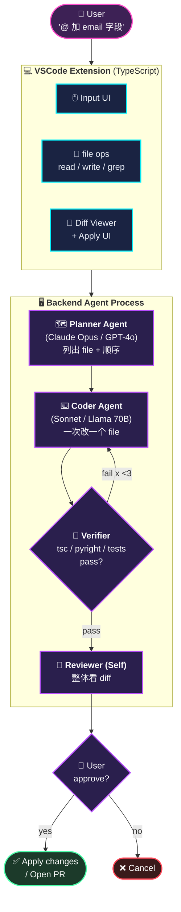
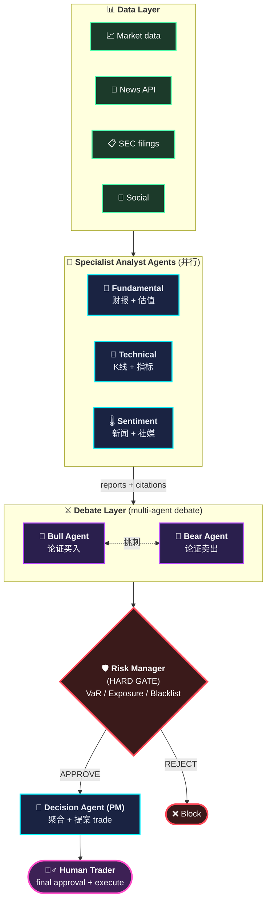
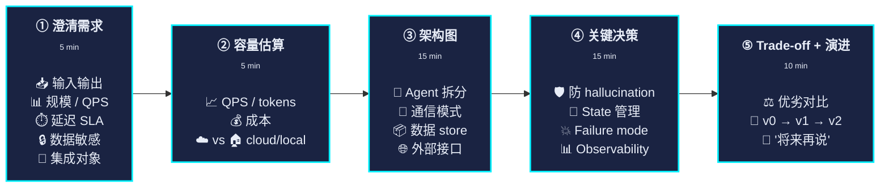

# Module 12 — 系统设计 4 题：从白板到落地

> Agent 系统设计是 2026 年新的 hot 系统设计题型。
> 这章给 4 道高频系统设计真题 + 完整解题思路，每道都按"需求 → 容量 → 架构 → 关键决策 → trade-off → 演进"五步走。
> 学完直接拿去回答。

---

## 题 1：设计一个多 Agent 代码 Review 系统

> "请设计一个 Agent 系统，自动 Review GitHub PR：分析代码改动，给出审查意见，必要时建议 reviewer。每天处理 1 万个 PR。"

### 需求澄清（5 分钟问对方）

- 输入：GitHub PR URL，diff 内容
- 输出：审查意见（comments）+ 是否 approve / request changes
- 频率：1 万 PR/天 ≈ 7 PR/分钟（峰值算 30 PR/分钟）
- 延迟要求：5 分钟内必须有反馈
- 范围：只看代码不看 issue / commit history？是否要 link 到相关 design doc？
- 集成：直接通过 GitHub Webhook + comments API？

### 容量估算

```
1万 PR/天 × 平均每 PR 200 行 diff × 100 字符 ≈ 200MB / 天
→ 单次 prompt：200 行 diff ≈ 5K tokens
→ Agent 来回 5 轮 → 每个 PR ≈ 25K input + 3K output tokens
→ 总 token：1万 × 28K = 280M tokens/天
→ 用 GPT-4o ($5/M in, $15/M out)：$1250+$45 ≈ $1300/天 ≈ $40K/月
→ 用本地 Llama-3 70B：成本约 $0（电费），但延迟 30s+/PR
```

**架构决策**：cost vs latency trade-off。
- 实时反馈走云端（5K 高优先 PR 用 GPT-4o）
- 异步批处理走本地（其他用本地大模型）

### 架构



### 关键设计决策

#### Specialist Agents 怎么设计

每个 reviewer 一个 Agent，独立 system prompt：
- **Style**：lint rules + 格式规范
- **Security**：OWASP top 10、依赖漏洞、敏感数据
- **Test Coverage**：是否新增对应测试
- **Architecture**：与现有模块边界、是否破坏抽象

为什么不一个大 Agent 包揽？
- **Specialization**：每个 Agent prompt 短小、专精
- **并行**：4 个 Agent 同时跑（节省 latency）
- **可独立 eval**：每个 reviewer 单独打分

#### Aggregator 决策逻辑

```python
def aggregate(reviews):
    if any(r.severity == "critical" for r in reviews):
        return "REQUEST_CHANGES"
    if all(r.verdict == "approved" for r in reviews):
        return "APPROVE"
    return "COMMENT"  # 中性
```

**不全靠 LLM 决策**——critical 是结构化标记，规则触发。

#### 防 Hallucination

Reviewer 必须**引用具体代码行号**：

```
"In src/utils.py:42, the regex `r'.*'` matches everything,
which seems unintended. Did you mean `r'.+'`?"
```

如果 reviewer 给意见但不带 line:N 引用 → 框架拒绝（structural gate）。

#### 上下文管理

PR diff 可能很长（10K+ 行）。策略：
- 每个 file 单独 review（split context）
- 只看 changed lines + N lines context（不读整个 file）
- 大 diff 自动 fall back 到 sampling（只 review 关键 file）

### Trade-offs

| 决策 | 优 | 劣 |
|---|---|---|
| 多 Specialist | 并行 / 专精 | 4× LLM 调用，成本高 |
| 云端 Fast + 本地 Batch | 兼顾延迟和成本 | 两套 infra 维护 |
| Aggregator + 规则 | 决策可控 | 规则维护成本 |
| 强制行号引用 | 防 hallucination | 减少了 Agent 灵活性 |

### 演进路径

- v0：单 Agent + GPT-4o，跑 100 PR/天验证流程
- v1：拆 4 个 specialist + aggregator，跑 1K PR/天
- v2：本地大模型加 batch lane，扩到 1 万 PR/天
- v3：加 fine-tune（用历史 review 数据训自己的 reviewer 模型）

---

## 题 2：设计一个 Customer Support Agent 网络

> "为一个 SaaS 产品设计 Customer Support Agent 系统：用户聊天问问题，Agent 处理 80% 简单问题，复杂问题转人工。每天 100K conversations。"

### 需求澄清

- 用户接入：Web chat、Email、WeChat、Slack？
- 问题类型：账户问题、技术问题、销售咨询、bug report
- 转人工标准：什么时候 escalate？
- 数据敏感：用户消息有 PII，是否能上云端？
- 多语言？

假设：Web chat + Email，4 大类，PII 敏感，中英双语。

### 容量

```
100K conv/天 / 8h 高峰 ≈ 12K/h ≈ 200/min
峰值 500/min
平均每 conv 5 轮 → 1000 LLM calls/min
平均每轮 4K tokens → 4M tokens/min → 240M tokens/h
```

成本（云端 GPT-4o）：~$5K/天。本地（Llama 70B）：硬件 + 人力 ≈ $50K/月一次性。
1 个月以上的运行就该考虑本地。

### 架构



### 关键设计决策

#### 路由 Agent 的设计

**轻量分类器**——不要用大 LLM。可以用：
- 小模型 fine-tuned（几 M params 即可）
- 或 embedding + KNN（速度快、可解释）
- 或纯规则（关键词触发）

为啥不用大 LLM 路由？**每天 100K 次太贵**。轻量分类器 95% 准确率 + 5% 走 fallback 就行。

#### Knowledge Retrieval (RAG)

每个 specialist 都接一个 RAG，检索产品文档 / 历史 ticket / FAQ。

```
user: "我怎么导出数据？"
       │
       ▼
[Retrieve top 5 docs based on semantic similarity]
       │
       ▼
LLM(user_msg + retrieved_docs) → answer
```

**关键**：retrieved doc 必须出现在 prompt 里给 LLM 看，不要让 LLM 自己"想"答案——hallucination 主要来源就是没 ground 在 retrieved 内容上。

强制要求 LLM 在答案里 cite 来源（"根据《数据导出指南》"），方便用户核实。

#### Escalation 触发

四类：
1. **Confidence 低**：LLM 自评 confidence < 0.6（用 logprobs 或 explicit ask）
2. **用户要求人工**："我要找客服" / "talk to human"
3. **Topic 危险**：投诉、要求退款、提到法律
4. **轮次超限**：5 轮没解决 → 人工

转人工时**带完整 context**：聊天历史 + Agent 试过什么 + 检索到的 doc。

#### PII 处理

用户消息可能有：
- 邮箱 / 手机
- 订单号
- 银行卡号

策略：
- **本地跑**（不发到云端）—— 大幅降低风险
- 或 **PII redaction**：发给 LLM 前先 mask（`<EMAIL>`, `<PHONE>`），收到回复后还原

不能用云端 LLM 处理含 PII 的消息，除非有签 BAA / DPA。

### Trade-offs

| 决策 | 优 | 劣 |
|---|---|---|
| 路由用小模型 | 快、便宜 | 错路由率比大 LLM 高 |
| RAG | 减少 hallucination | 检索质量决定 Agent 上限 |
| 强制 cite | 用户可验证 | 增加输出长度 |
| 本地跑 | PII 安全 | 硬件投入大 |
| Escalation 多触发 | 用户体验好 | 转人工率高，省人不多 |

### 演进

- v0：Single Agent + GPT-4 + 公开文档，500 conv/天
- v1：路由 + 4 specialist，10K/天
- v2：RAG + escalation，100K/天
- v3：本地化 + PII redaction，合规上线

---

## 题 3：设计一个 LLM-Powered IDE 助手（如 Cursor）

> "设计一个像 Cursor 的 IDE Agent：用户 @ 提一个需求，Agent 自动分析代码、改文件、跑测试、提交 PR。"

### 需求澄清

- 集成形式：VSCode 插件 / 独立 IDE / Web IDE？
- 项目规模：单 file edit、多 file refactor、跨 repo 改？
- 模型：本地 / 云端 / 用户自带 key？
- 协作：单用户 or 团队？

假设：VSCode 插件、多 file edit、用户带 key、单用户。

### 架构



### 关键决策

#### Code Context 怎么塞

代码库可能 100K 行。不能全塞 context。

策略（按效果排序）：
1. **Symbol indexing**：用 ts-morph / tree-sitter 建 AST 索引，按需 lookup
2. **Embedding-based retrieval**：每个 file/function 算 embedding，按语义检索
3. **静态依赖分析**：从 import / call graph 找相关 file
4. **用户显式 @-mention**：用户告诉 Agent 哪些 file 相关

Cursor 实际用 1 + 2 + 3 + 4 的混合。

#### 多 file edit 的原子性

用户：" 把 user model 加一个 email 字段，所有用到的地方都改"

涉及：
- `models/user.py`
- `migrations/add_email_to_user.py`
- `api/user.py`
- `tests/test_user.py`
- `templates/user_form.html`

策略：
- Planner 列出所有 file 和顺序
- Coder 一个一个 file 改
- 全部改完一次性 show diff 给用户
- 用户 approve 全套 才 apply

不能一个一个 apply——中间状态可能 broken，用户看到一半会困惑。

#### Verifier 的设计

跑：
- `tsc` / `pyright` / linter
- 已存在的 test suite
- 简单语法检查

如果 fail：
- 把 error 给 Coder
- Coder 重试一轮（最多 3 次）

#### 模型选型

- **Planner**：需要 reasoning，用 Claude Opus / GPT-4o
- **Coder**：需要代码细节，用 GPT-4o / Claude Sonnet / Llama-3.1-70B（本地 fall back）
- **Verifier**：基本不用 LLM，靠工具

#### Apply 模式

VSCode 插件需要支持：
- **Inline diff**（hunk by hunk）
- **Full file diff**
- **撤销**（每个 apply 都进 undo stack）

不能"一键全 apply 不让回头" —— 用户敢用的前提是能撤销。

### Trade-offs

| 决策 | 优 | 劣 |
|---|---|---|
| 多 Agent 协作 | 专精 | 延迟 / 成本高 |
| 全文 embedding 索引 | 检索准 | 启动慢、占空间 |
| 一次 apply 全部 file | 原子性 | 用户看 diff 量大 |
| 强 verifier loop | 质量好 | 慢，增加成本 |

---

## 题 4：设计一个 Multi-Agent Trading 系统（高难度）

> "设计一个量化交易 Agent 系统：多个 Agent 各自分析市场（基本面、技术面、情绪面），最终决策买卖。"

### 需求澄清

- 实时性：tick-level / 分钟级 / 日频？
- 资产：股票 / 加密币 / 期货？
- 风险偏好 / 资金规模？
- 法规要求（涉及金融，必须人工 final approval）

假设：日频股票、中等规模（$10M）、最终人审。

### 架构



### 关键决策

#### 为什么用 Debate？

**Bull/Bear Agent 互相挑刺** 比单 Analyst 更稳健——能暴露假设的弱点。
学术上叫 [Multi-Agent Debate](https://arxiv.org/abs/2305.14325)。

实操：
- Bull Agent 论证"这股该买"
- Bear Agent 论证"这股该卖"
- 反复 N 轮，每轮看对方 argument
- 最后两边的最终结论都给 Decision Agent

#### Citation 必须严格

任何"基本面"分析必须 cite 财报里的具体数字 + 来源（SEC filing 链接）。
任何"sentiment"必须 cite 具体新闻 / tweet。

无 citation 的论断 → Decision Agent 拒绝采纳。

防 hallucination 是金融领域的生死线。

#### Risk Manager 是 hard gate

不是给"建议"——是 **veto 权**。

```python
def risk_check(proposed_trade):
    if total_exposure() + proposed_trade.notional > LIMIT:
        return REJECT
    if var_after_trade() > VAR_LIMIT:
        return REJECT
    if proposed_trade.symbol in BLACKLIST:
        return REJECT
    return APPROVE
```

LLM 不能 override risk manager。

#### Human in the Loop

法规 + 风险 → 任何实际执行必须人工 click。
Agent 提"建议"，trader 看 reasoning，决定执行 / 不执行 / 修改。

#### Backtest 是必须

部署前必须用历史数据回测：
- 过去 5 年走一遍
- 比较 vs benchmark (S&P 500)
- Sharpe ratio / max drawdown
- 单 specialist 准确率拆解

只看 P&L 不够——要看**Agent 的推理是否合理**（人工抽 50 个 trade 看 reasoning）。

### Trade-offs

| 决策 | 优 | 劣 |
|---|---|---|
| Debate Layer | 思路全面 | 慢 + 贵 |
| Hard Risk gate | 安全 | Agent 灵活性受限 |
| Human approval | 合规 | 不能高频 |
| Strict citation | 防 hallucination | 信息处理慢 |

### 监管考虑

- 所有决策必须 audit log（保留 7 年）
- Agent 推理过程必须可解释（不能黑箱）
- 模型版本 / prompt 版本必须 hash 记录
- 可能需要 SEC / FINRA 注册（看具体业务）

---

## 系统设计题的通用框架

不管什么 Agent 系统设计题，按这 5 步：



**练习方法**：在白板上花 1 小时画一道题，对照文中思路看自己漏了哪些。漏的就是面试时会被问到的。

---

## 自测题

1. 自己重新画一遍 Code Review 系统的架构图
2. Customer Support 系统里 Router 为什么用小模型？
3. IDE Agent 怎么处理"context 比 100K 还大"的 codebase？
4. Trading 系统里 Risk Manager 为什么必须有 veto 权？
5. 通用 5 步框架，每步关键产出物是什么？

---

## 收尾

**完整教程到此结束**。如果你按顺序读完了 12 个模块 + 50 道 Q&A + 4 道系统设计，你已经具备：

- 在白板上从 LLM 一路画到生产 multi-agent system 的能力
- 能独立设计、实现、debug、部署一个 Agent 系统
- 能在面试里 30 分钟讲清楚一个真实项目（这个仓库）
- 能识别现成框架的局限并解释为什么手撸更合适

下一步建议：

1. **跑通 OpenClaw 公司**：花 2 小时按 `setup-company.sh` 走一遍，亲手触一下每个细节
2. **改一个 Agent 的 persona**：体会"prompt 改一行，行为大变"
3. **加一个新角色**：比如加一个"安全审计 Agent"
4. **接你自己的项目**：把这些技术应用到你的真实工作

祝面试顺利。

— 教程结束 —

[返回首页 README](../README.md) | [Module 11 Q&A](11-interview-qa.md) | [GitHub 仓库](https://github.com/doraemonlyz-jpg/openclaw-setup-guide)
